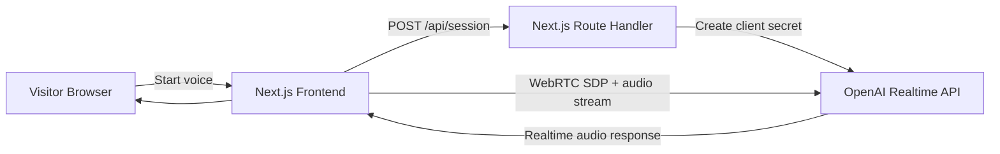

# Pavan Kumar — AI Portfolio

<p align="center">
  A production-style personal portfolio with a realtime voice assistant.
</p>

<p align="center">
  
  
  
  
  
</p>

---

## Why this project

This repo showcases my profile as an AI Engineer, with:
- a modern portfolio UI,
- a recruiter-friendly work experience timeline,
- and a live voice assistant that answers questions about my background.

The goal is to demonstrate not only frontend polish but also practical AI integration and deployment workflow.

## Live experience

- **Portfolio sections:** Hero, Work Experience, Projects, Certificates, Contact
- **Voice assistant:** OpenAI Realtime + WebRTC (low-latency voice interaction)
- **Interactive UI:** animated live orb, speaking/listening states, image previews, hover polish

## Tech stack

- **Frontend:** Next.js App Router, React, TypeScript, Tailwind CSS
- **AI Voice:** OpenAI Realtime API (`gpt-realtime`)
- **Realtime transport:** Browser WebRTC + DataChannel events
- **Backend API route:** Next.js route handler for ephemeral session secret
- **Deployment:** Vercel
- **CI/CD:** GitHub Actions (lint + build + production deploy)

## Architecture



## Voice assistant flow

1. User clicks **Start live**
2. Frontend calls `POST /api/session`
3. Server creates an OpenAI realtime client secret
4. Browser opens WebRTC session to OpenAI realtime
5. User speaks, model responds with voice in realtime
6. UI updates states: idle / connecting / listening / speaking

## Key files

- `app/page.tsx` — portfolio layout and sections
- `components/VoiceAgent.tsx` — live voice UI + WebRTC client logic
- `content/voice-agent.ts` — assistant profile content and behavior instructions
- `app/api/session/route.ts` — server-side session creation for realtime client secret
- `.github/workflows/deploy-vercel.yml` — CI/CD pipeline

## Local setup

### 1) Install dependencies

```bash
npm install
```

### 2) Add environment variables

Create `.env.local`:

```bash
OPENAI_API_KEY=your_openai_api_key
# optional: one of alloy, ash, ballad, coral, echo, sage, shimmer, verse, marin, cedar
OPENAI_REALTIME_VOICE=cedar
```

### 3) Run locally

```bash
npm run dev
```

Open `http://localhost:3000`.

## Quality checks

```bash
npm run lint
npm run build
```

## CI/CD

Workflow: `.github/workflows/deploy-vercel.yml`

- **On PR to main:** lint + build
- **On push to main:** lint + build, then deploy to Vercel using CLI + project secrets

Required GitHub secrets:
- `VERCEL_TOKEN`
- `VERCEL_ORG_ID`
- `VERCEL_PROJECT_ID`

## Roadmap ideas

- Add downloadable PDF resume
- Add role-specific “Ask me about…” prompt chips
- Add multilingual mode (EN/DE)
- Add analytics for visitor interactions

## Inspiration

I took inspiration from high-quality, polished open source READMEs that combine strong structure, visuals, and clear engineering storytelling, such as [openclaw/openclaw](https://github.com/openclaw/openclaw).
